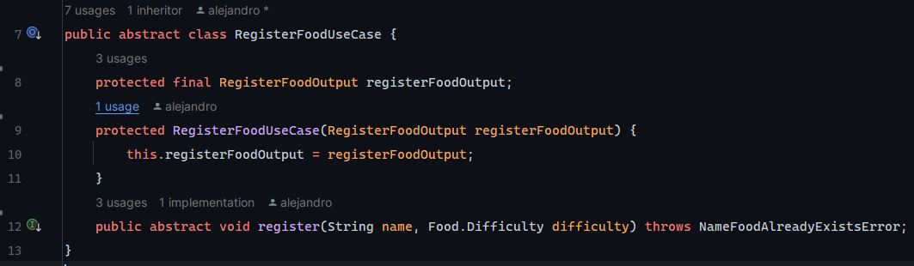

# Abstract Services

Project to evaluate the use of abstract classes in defining services instead of interfaces.

## Technologies Used

- Maven
- Spring Boot
- H2

## Example

#### Abstract class for registering a new food Use Case

#### Use Case implementation
